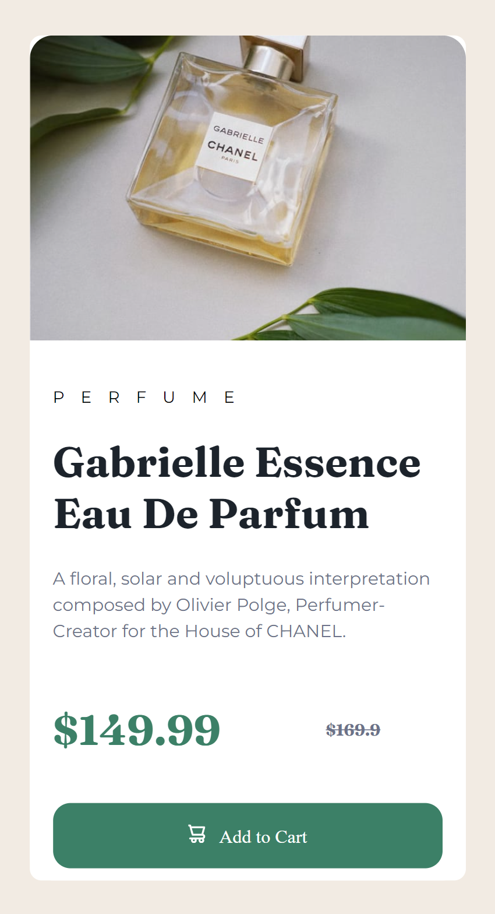

# Frontend Mentor - Product preview card component solution

This is a solution to the [Product preview card component challenge on Frontend Mentor](https://www.frontendmentor.io/challenges/product-preview-card-component-GO7UmttRfa). Frontend Mentor challenges help you improve your coding skills by building realistic projects. 

## Table of contents

- [Frontend Mentor - Product preview card component solution](#frontend-mentor---product-preview-card-component-solution)
  - [Table of contents](#table-of-contents)
  - [Overview](#overview)
    - [The challenge](#the-challenge)
    - [Screenshot](#screenshot)
    - [Links](#links)
  - [My process](#my-process)
    - [Built with](#built-with)
    - [What I learned](#what-i-learned)
    - [Continued development](#continued-development)
    - [Useful resources](#useful-resources)
  - [Author](#author)
  - [Acknowledgments](#acknowledgments)

**Note: Delete this note and update the table of contents based on what sections you keep.**

## Overview

### The challenge

Users should be able to:

- View the optimal layout depending on their device's screen size
- See hover and focus states for interactive elements

### Screenshot




### Links

- Solution URL: [Add solution URL here](https://your-solution-url.com)
- Live Site URL: [Add live site URL here](https://your-live-site-url.com)

## My process

### Built with

- Semantic HTML5 markup
- CSS custom properties
- Flexbox
- Mobile-first workflow


### What I learned

i learned to be able to start witn mobile first before doing desktop view, and it was challenging , i learnt that content will prevent to stratch than using background image. i so the importance of align self in flexbox to position a specific element. and flexbox nesting can best work when your html is place accordingly


To see how you can add code snippets, see below:

```html
<div class="price__tag">
    <p class="first__price">$149.99</p>
    <p class="second__price">$169.9</p>
  </div>
  
  <div>
    <a class="call__to-action" href="">  Add to Cart</a>
  </div> 
```
```css
 .image__product {
            content: url(images/image-product-desktop.jpg);
            border-radius: 10px 0px 0 10px ;
            width: 50%; 
        }
```


### Continued development

i will work more on these
image responsivesness
nested flexbox/ flexbox items
responsivenes


### Useful resources

- [Example resource 1](https://www.youtube.com/watch?v=mpYtrgB3b6o&list=PL0Zuz27SZ-6Mx9fd9elt80G1bPcySmWit&index=18) - This helped me for mobile design first. I really liked how he     
 made the flexbox and will use it going forward.
- [Example resource 2]( https://www.taniarascia.com/design-for-developers/) - This is an amazing article which helped me finally understand how to put the padding. I'd recommend it to anyone still learning this concept.

## Author


- Frontend Mentor -  [@lidma](https://www.frontendmentor.io/profile/lidma)


## Acknowledgments

This tutorial was very helpful https://www.taniarascia.com/design-for-developers/


